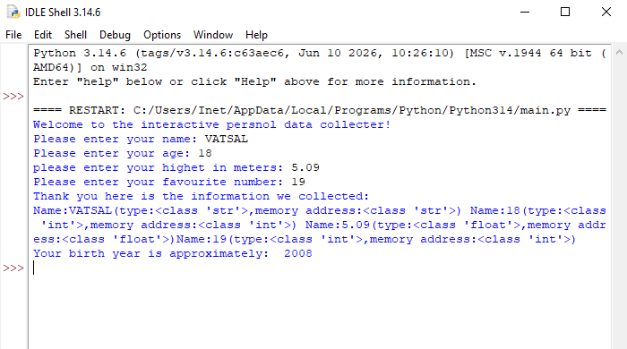

# INTERACTIVE PERSNOL DATA COLLECTER 

## PROJECT SUMMARY

This is a beginner-friendly Python project that collects personal information from the user and displays the collected data in a simple format.

## 


## 💡 FEATURES

* "input()" and "print()"
* Variables
* Data types ("str", "int", "float")
* Type casting
* Basic calculations
* "type()" function
* "id()" function


## Technologies used 
* python

## ▶ How to run

1. install python
2. open your project folder
3. open the terminal and run the file
4. run the program using:
```bash
python main.py
```

After collecting the information, the program process the data displays the result. it also shows the data type and ID of the variable

## 📂 project structure

```text
project
|main.py
|image.png
|README.md
```
## objective

The main objective of this project is to understand and practice the fundamentals of pytjon programming through a simple interactive program.

## Conclusion

This project helped me understand basic python concepts like variables,data types,input/output,type casting functions sach as type() and id()

## AUTHOR

** VATSAL SOLANKI **

